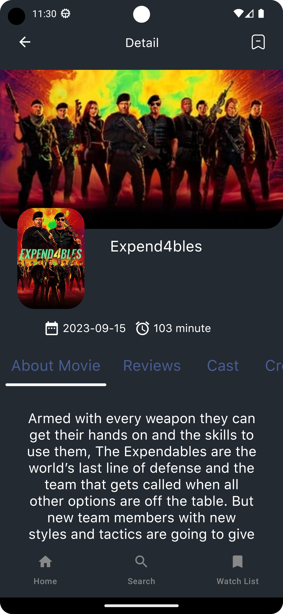
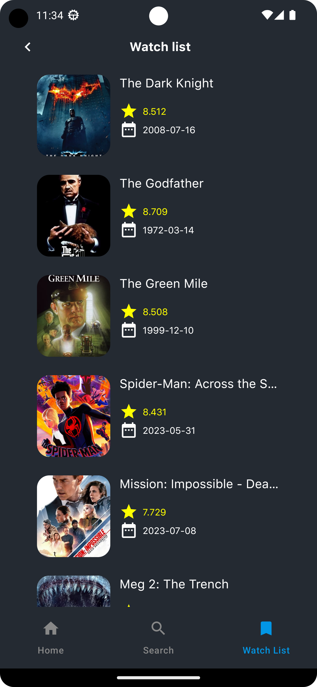

# A program written entirely in Kotlin using the principles of Clean Architecture according to the MVVM pattern.

Unfortunately, this application is not intended for movie viewing in it you can find out the rating
of the movie and the Description and actors

## ScreenShots

## Libraries

* [Jetpack Compose](https://developer.android.com/jetpack/compose) Jetpack Compose is Android’s
  recommended modern toolkit for building native UI. It simplifies and accelerates UI development on
  Android. Quickly bring your app to life with less code, powerful tools, and intuitive Kotlin APIs.

* [Kotlin flows](https://developer.android.com/kotlin/flow) In coroutines, a flow is a type that can
  emit multiple values sequentially, as opposed to suspend functions that return only a single
  value. For example, you can use a flow to receive live updates from a database.

* [Kotlin Coroutines](https://github.com/Kotlin/kotlinx.coroutines) Coroutines is a rich library for
  coroutines developed by JetBrains. It contains a number of high-level primitives with support for
  coroutines, which are discussed in this guide, including startup, asynchrony, and others.

* [ViewModel](https://developer.android.com/topic/libraries/architecture/viewmodel) Data related to
  the user interface that is not destroyed when the application is rotated. Easily schedule
  asynchronous tasks for optimal execution.

* [Lifecycle](https://developer.android.com/topic/libraries/architecture/lifecycle) An interface
  that automatically responds to lifecycle events.

* [Retrofit](https://developer.android.com/codelabs/basic-android-kotlin-compose-getting-data-internet#0)
  This is
  a library for working with the REST API in Android. It makes it easy to interact with the server
  and execute HTTP requests.
  The library itself creates the necessary classes for executing requests and processes responses.

* [Hilt](https://developer.android.com/training/dependency-injection/hilt-android) Hilt is a
  Dependency Injection (DI) library for the Kotlin programming language. It was developed by Google
  to simplify the process of implementing dependencies in Android applications.

* [Room](https://developer.android.com/training/data-storage/room) Room is a library for working with
  databases that provides strict validation at the compilation stage and reduces the likelihood of
  errors during application execution